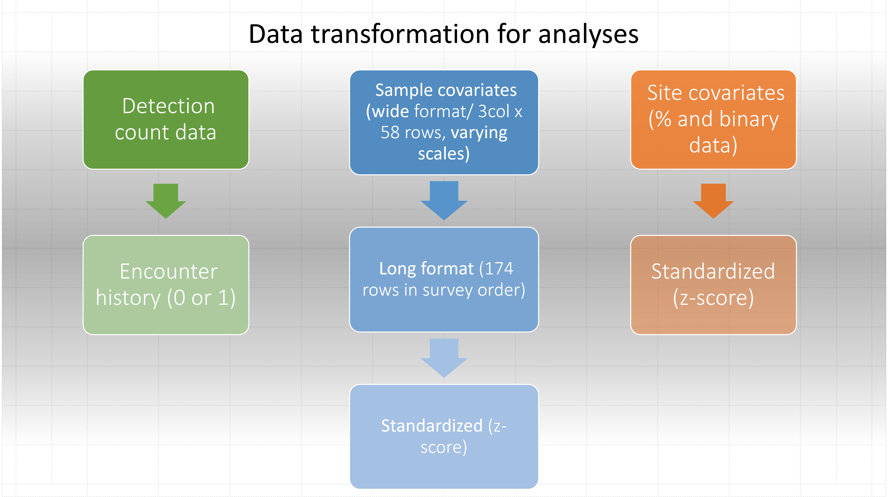

### Helpful information :sun_with_face:

- [How many covariates should you include in a model?](https://youtu.be/tCh7rTu6fvQ?feature=shared)
- [Program PRESENCE and RPresence forum](http://www.phidot.org/forum/viewforum.php?f=14)
- [unmarked forum](https://groups.google.com/g/unmarked)
- [Scale your covariates](https://groups.google.com/g/unmarked/c/vvHQxFhY7W8)
- [When to use AICc](https://builtin.com/data-science/what-is-aic)
- [Exercises in Occupancy Estimation and Modeling: SINGLE-SPECIES, SINGLE-SEASON OCCUPANCY MODELS](https://www.uvm.edu/~tdonovan/Occupancy%20Exercises/Exercise3/Exercise%203.%20%20Single-Species,%20Single-Season%20Occupancy%20Models.pdf)
- [Exercises in Occupancy Estimation and Modeling: ROYLE-NICHOLS ABUNDANCE INDUCED
HETEROGENEITY](https://www.uvm.edu/~tdonovan/Occupancy%20Exercises/Exercise7/Exercise%207.%20%20Royle-Nichols%20Abundance%20Induced%20Heterogeneity.pdf)
- [Plotting correlation between covariate and psi/p](http://www.phidot.org/forum/viewtopic.php?f=11&t=4351#p14475)
 

