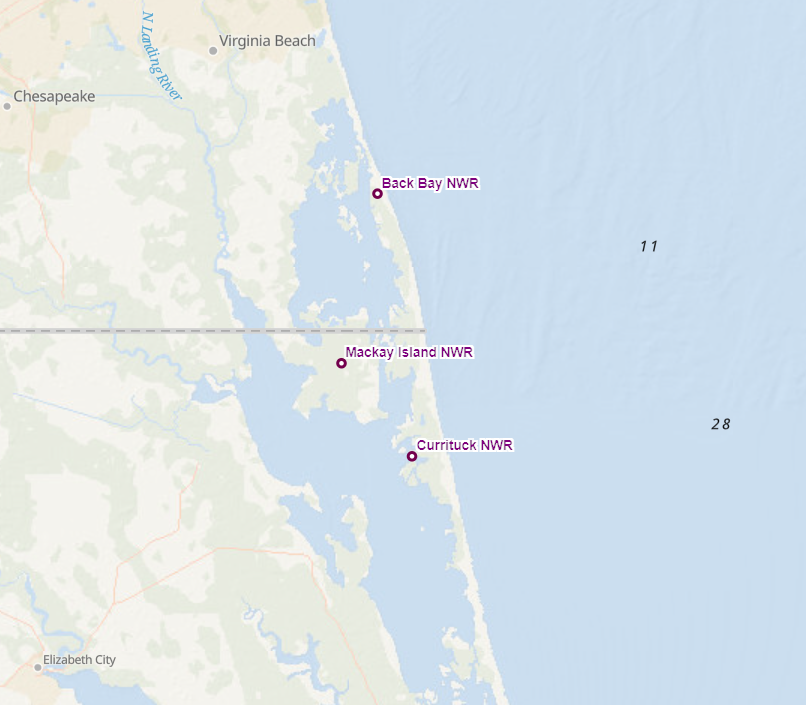

## King Rail Occupancy and Abundance in Coastal North Carolina and Virginia
- - - -

### Aim
I am interested in king rail occupancy and abundance in regions surrounding a [source population](https://ecos.fws.gov/ServCat/DownloadFile/106667) at Mackay Island National Wildlife Refuge.

***
### Repo Contents 
- **Analyses**: subdirectories containing markdown files with analysis steps in R.
- **Bin**: R script by Carol Gause.

***
### Contributor 
- [Carol Gause](http://www.balalab.com/people.html)   

---
### Funding Sources
Grant funding for this project was generously awarded by The Garden Club of America, The Carolina Bird Club, and The Association of Field Ornithologists.

---    
### Thank you  
Thank you to my hard-working technicians who diligently assisted with data collection in the field:
- Megan Linke
- Abby Bourne
- Nic Main

---  
### Natural history & background
The  king rail is a very secretive, freshwater marsh bird. While it is chicken-sized, it is very hard to see due to the dense emergent vegetation it inhabits. As you might imagine, this makes these rails very difficult to study. For this reason, we don't know as much about king rails as we do about easier-to-study species. It is really important to study these birds as they are indicators of freshwater marsh ecosystem health. They are sensitive to environmental changes, and their [populations have been declining for over half a century](https://abcbirds.org/bird/king-rail/). The king rail is listed as [federally endangered in Canada](https://naturecanada.ca/discover-nature/endangered-species/king-rail/) and as [threatened or endangered by 12 states in the United States](https://birdsoftheworld.org/bow/species/kinrai4/cur/introduction#:~:text=Despite%20this%20broad%20geographic%20range,as%20well%20as%20in%20Canada.).  
 
In the United States, the distribution of the king rail has become concentrated along the east coast. This is a result of inland freshwater marshes vanishing [due to land-use changes and habitat degradation](https://portal.ct.gov/DEEP/Wildlife/Fact-Sheets/King-Rail). This has led to the remaining freshwater marshes in the southeast becoming the primary habitat for these birds. However, populations along the east coast face their own challenges: climate change has led to sea-level rise and increased occurrences of intense storms resulting in saltwater intrusion. This change in habitat conditions [renders these areas unsuitable for the king rail](https://www.allaboutbirds.org/guide/King_Rail/lifehistory#). The clapper rail, which is tolerant of saltwater, [often out-competes the king rail in brackish habitats](https://www.ncbi.nlm.nih.gov/pmc/articles/PMC6202719/). Additionally, the presence of the invasive plant *Phragmites australis* in both inland and coastal marshes further complicates the situation. King rails can tolerate this plant but have not been observed nesting in it.  

**For these reasons, it is becoming increasingly urgent to learn more about this species.**  

 ---
#### Survey area

